# Laser Engraver Robot – Automatic Control & PID Simulation

## 1. Project Overview

This project presents the design, modeling, and control analysis of a **Laser Engraver Robot** using MATLAB and automatic control principles.

A laser engraver robot is a robotic system used to perform accurate engraving, cutting, and marking operations on different materials using laser technology. These systems are used in industrial production, product marking, creative design, and automated manufacturing applications.

The main objective of this project was to model the robot arm, analyze its motion behavior, calculate its degree of freedom, apply PID control, and compare the system performance before and after control implementation.

The project includes:

* MATLAB-based robot arm representation
* Robot arm element identification
* Degree of Freedom analysis
* PID control system design
* Motion comparison before and after control
* Before-control and after-control motion videos in MP4 format
* Letter trajectory tracking for O, M, and L
* Angle-time response analysis for robot joints

---

## 2. Engineering Problem

Laser engraving requires accurate positioning and stable motion control. If the robot arm is not properly controlled, the laser tool may not follow the desired path accurately.

This can lead to:

* Poor engraving quality
* Path deviation
* Unstable movement
* Inaccurate letter shapes
* Weak trajectory tracking

The engineering problem in this project was:

> How can a robotic laser engraving mechanism be modeled and controlled to improve motion accuracy and trajectory tracking?

To solve this problem, the robot mechanism was modeled and analyzed, then a PID control system was applied to improve the response of the system and reduce motion error during the engraving process.

---

## 3. My Role in the Project

My role in this project included:

* Studying the working principle of laser engraving robotic systems
* Creating the robot arm representation in MATLAB
* Identifying the main elements of the robot arm
* Performing Degree of Freedom analysis
* Applying automatic control concepts
* Designing and using a PID control system
* Comparing robot motion before and after control
* Adding MP4 motion videos to demonstrate the improvement
* Analyzing the engraving trajectories of letters O, M, and L
* Evaluating angle-time response graphs
* Preparing the final automatic control presentation

---

## 4. Tools & Software Used

The following tools and engineering concepts were used in this project:

* **MATLAB** – robot arm drawing, simulation, and plotting
* **Automatic Control Theory** – system response and feedback control
* **PID Controller** – improving system accuracy and stability
* **Mechanism Analysis** – studying links, joints, and motion
* **Degree of Freedom Analysis** – evaluating system mobility
* **Trajectory Analysis** – comparing desired and actual motion paths
* **Angle-Time Graphs** – analyzing joint behavior over time
* **MP4 Video Demonstration** – showing before-control and after-control motion
* **PowerPoint** – preparing the final engineering presentation

---

## 5. Step-by-Step Project Workflow

### Step 1: Understanding the Laser Engraver Robot

The project started by studying the function of a laser engraver robot.

A laser engraver robot uses laser technology to engrave, cut, or mark materials with high precision. The robot must move accurately along a required path so the laser can create the correct shape or pattern.

Applications of this type of robot include:

* Industrial marking
* Product labeling
* Artistic engraving
* Automated cutting
* Manufacturing processes
* Surface marking

---

### Step 2: MATLAB Robot Arm Drawing

The robot arm was represented in MATLAB to visualize the mechanical structure of the laser engraver system.

The MATLAB drawing helped show:

* Robot arm links
* Joint locations
* General robot configuration
* End-effector movement
* Motion path of the laser tool

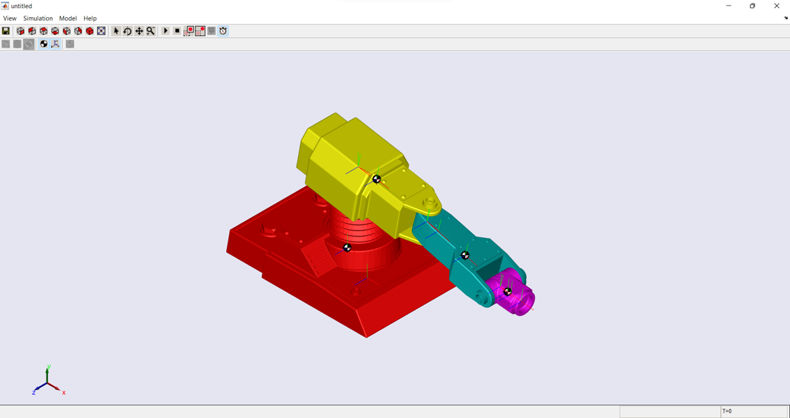

---

### Step 3: Identifying Robot Arm Elements

The main robot arm elements were identified to understand how the system performs motion.

The robot system included:

* Base support
* Robot links
* Joints
* End-effector
* Laser engraving tool
* Motion path elements

This step was important because understanding the mechanical structure helps in analyzing movement, calculating degree of freedom, and designing the control system.

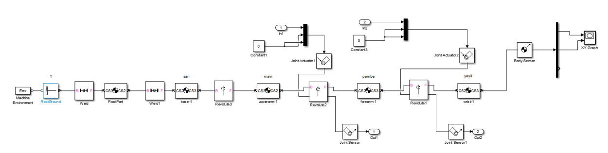

---

### Step 4: Degree of Freedom Analysis

A Degree of Freedom analysis was performed to understand the mobility of the laser engraver robot mechanism.

Degree of Freedom, or DOF, describes how many independent movements a mechanism can perform. This is important in robotic systems because it helps determine how flexible and controllable the robot arm is.

The planar mechanism mobility equation was used:

```text
F = 3(n - 1) - 2e1 - e2
```

Where:

```text
F  = Degree of Freedom
n  = Number of links
e1 = Number of one-degree-of-freedom joints
e2 = Number of two-degree-of-freedom joints
```

For this robot mechanism:

```text
n  = 5
e1 = 3
e2 = 0
```

Substituting the values into the equation:

```text
F = 3(5 - 1) - 2(3) - 0
F = 3(4) - 6
F = 12 - 6
F = 6
```

Therefore:

```text
F = 6 degrees of freedom
```

The result shows that the robot has **6 degrees of freedom**, meaning it is a multi-degree-of-freedom system.

This makes the control system important because the robot has several possible independent motions. To achieve accurate laser engraving, the robot motion must be controlled properly so the laser tool can follow the desired trajectory.

The DOF analysis helped show why a PID controller was needed to improve stability, reduce error, and improve trajectory tracking.

---

### Step 5: PID Control System Design

A PID control system was applied to improve the motion accuracy of the robot arm.

PID control is one of the most widely used control methods in engineering systems. It uses three control actions:

* **Proportional Control:** responds to the current error
* **Integral Control:** reduces accumulated steady-state error
* **Derivative Control:** predicts the change of error and improves response behavior

The PID controller was used to improve:

* Motion accuracy
* System stability
* Trajectory tracking
* Engraving quality
* Dynamic response
* Smoothness of movement

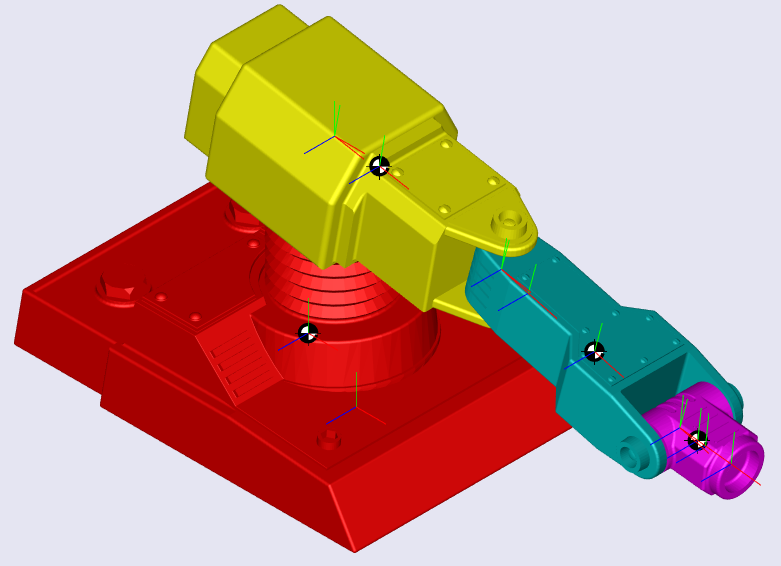

---

### Step 6: Motion Analysis Before Control

Before applying the PID control system, the robot motion was tested without control.

The uncontrolled system showed less accurate trajectory tracking. This means the robot was not following the required engraving path with enough precision.

The robot path was tested using letter engraving examples:

* Letter O
* Letter M
* Letter L

#### Before Control Motion Video

This MP4 video demonstrates the robot motion before applying the PID controller.

Before control, the robot movement was less stable and the engraving trajectory did not accurately follow the desired path.


https://github.com/user-attachments/assets/1eda7de9-5f0c-4c74-a9ca-bbeb0c9dc482


#### Before Control Letter Results

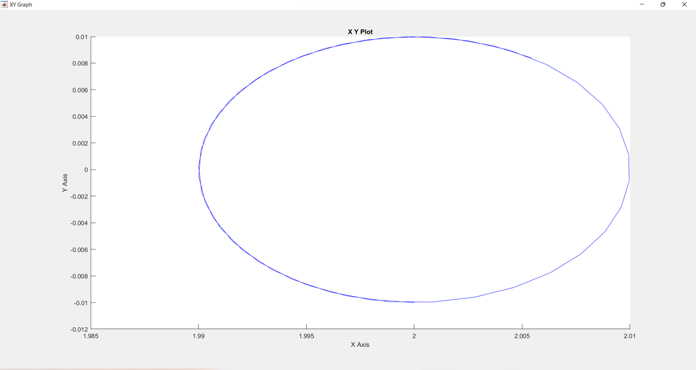

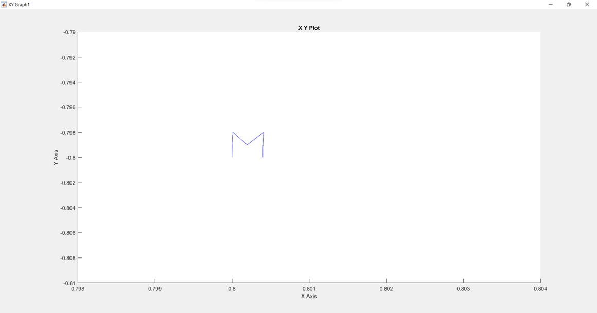

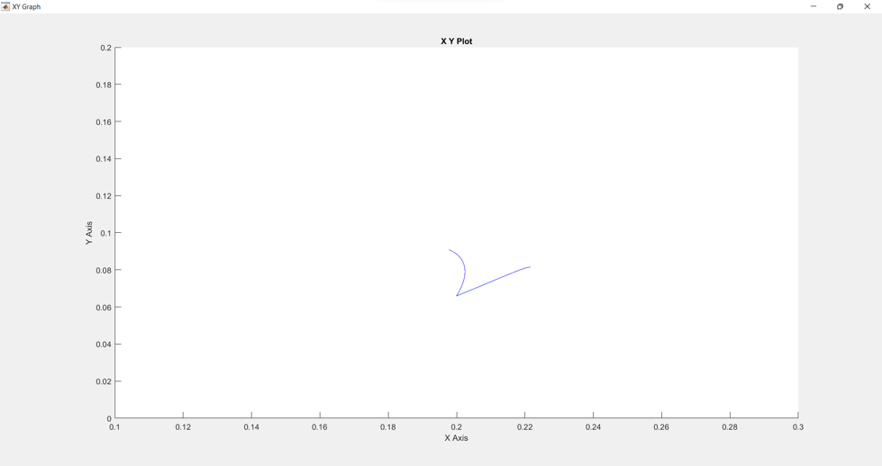

---

### Step 7: Motion Analysis After PID Control

After applying the PID controller, the robot motion became more accurate and the trajectory tracking improved.

The controlled system showed better alignment with the desired letter paths. This means the laser engraver robot was able to follow the required shapes more effectively.

The comparison after control showed improvement in:

* Path tracking
* Letter shape accuracy
* Motion response
* Control stability
* Engraving quality
* Reduction of motion error


#### After Control Letter Results

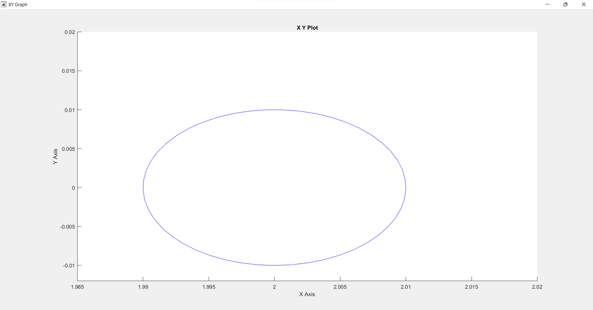

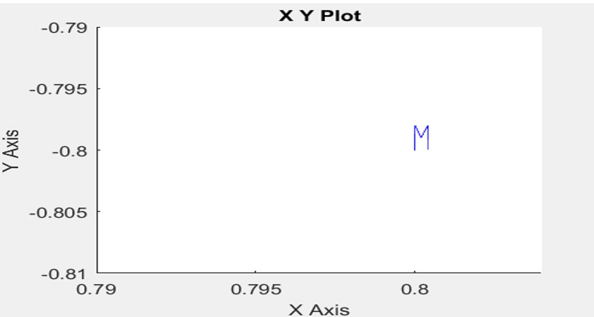

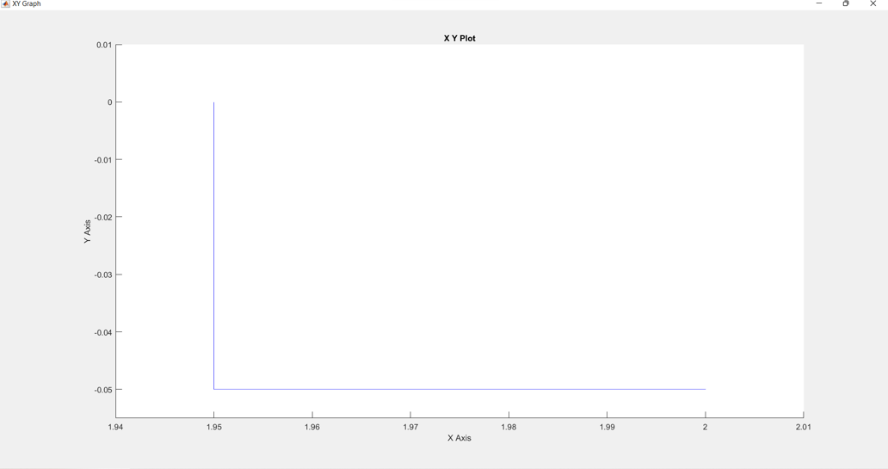

---

### Step 8: Angle-Time Response Evaluation

Angle-time graphs were used to analyze the dynamic behavior of selected robot joint pairs.

The project included angle-time analysis for:

* Joint pair 34
* Joint pair 45

These graphs helped evaluate how the robot joints changed their angular position over time.

The angle-time response was important because it helped show the effect of control on the movement of the robot joints.

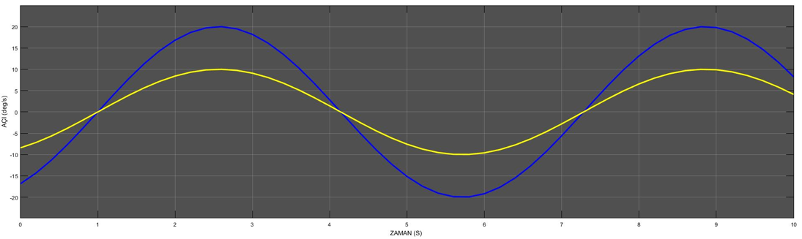

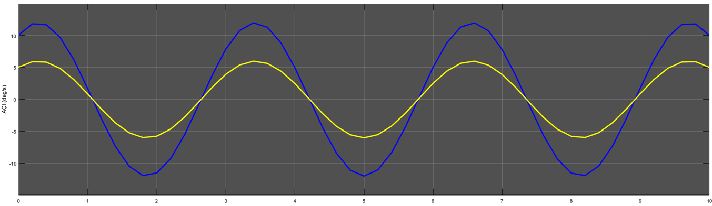

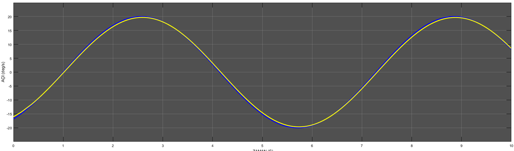

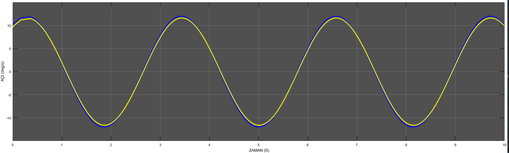

---

## 6. Engineering Analysis Performed

### Mechanism Analysis

The robot arm structure was analyzed by identifying the links, joints, base, and end-effector. This helped understand how the laser engraving robot moves and how each element contributes to the final motion.

The mechanism analysis was important because the laser engraving process depends on accurate movement of the robot arm and correct positioning of the laser tool.

---

### Degree of Freedom Analysis

The mobility of the robot mechanism was calculated using the planar mechanism mobility equation:

```text
F = 3(n - 1) - 2e1 - e2
```

The system values were:

```text
n  = 5
e1 = 3
e2 = 0
```

The calculation was:

```text
F = 3(5 - 1) - 2(3) - 0
F = 12 - 6
F = 6
```

The mechanism has **6 degrees of freedom**. This means that the robot is a multi-degree-of-freedom system and requires a proper control method to guide its movement accurately.

Because laser engraving requires precise path following, the DOF result supports the need for PID control to improve motion stability and reduce trajectory errors.

---

### Control System Analysis

A PID controller was applied to the robot system to improve its motion response.

The controller helped reduce the error between the desired trajectory and the actual robot movement. This improved the ability of the robot to follow engraving paths more accurately.

The PID controller contributed to:

* Better system stability
* Improved trajectory tracking
* Reduced motion error
* Smoother robot movement
* Better engraving quality

---

### Trajectory Tracking Analysis

The robot was tested using different letter paths. The letters O, M, and L were used to compare the motion before and after applying the PID controller.

Before control, the robot motion was less accurate and showed weaker tracking of the desired trajectory.

After control, the robot motion became more accurate and the letter shapes became closer to the desired paths.

---

### Video-Based Motion Comparison

Motion videos were added in MP4 format to show the robot behavior before and after applying control.

The before-control video shows the uncontrolled robot motion, while the after-control video demonstrates the improvement achieved using the PID controller.

This makes the project clearer and more professional because it shows the actual motion behavior instead of only showing static images.

---

### Graphical Response Analysis

Angle-time graphs were used to study the robot joint behavior over time.

These graphs helped evaluate the dynamic response of the system and observe the effect of control on joint movement.

The angle-time plots were used to analyze:

* Joint motion behavior
* Angular response over time
* Difference between before-control and after-control performance
* Stability improvement after applying control

---

## 7. Key Results / System Settings

The key results of the project were:

* A MATLAB model of the laser engraver robot was created.
* The robot arm elements were identified and explained.
* The Degree of Freedom of the robot mechanism was calculated.
* The robot was found to have 6 degrees of freedom.
* A PID control system was applied.
* The robot motion was compared before and after control.
* A before-control MP4 motion video was added to show the uncontrolled robot behavior.
* An after-control MP4 motion video was added to demonstrate the improvement after PID control.
* Letter engraving paths for O, M, and L were evaluated.
* Angle-time graphs were generated for selected joint pairs.
* The controlled system showed improved trajectory tracking compared to the uncontrolled system.
* The project demonstrated the importance of control systems in robotic laser engraving applications.

---

## 8. Project Images and Explanation

### MATLAB Robot Drawing

This image shows the MATLAB representation of the robot arm used in the laser engraving system.


---

### Robot Arm Elements

This image shows the main elements of the robot arm, including the links, joints, and motion structure.


---

### PID Control System

This image shows the PID control system used to improve robot motion accuracy.


---

### Before Control Motion Video

This MP4 video shows the motion of the laser engraver robot before applying the PID controller.

Before control, the robot motion was less stable and the engraving trajectory was not accurately following the desired path.


https://github.com/user-attachments/assets/faab7f9f-c189-4e85-9fca-752b63b2a4d0


---

### Letter O – Before and After Control


---

### Letter M – Before and After Control


---

### Letter L – Before and After Control


The before-and-after comparison shows the effect of the PID controller on the robot motion. After control, the engraving paths became more accurate and closer to the desired shapes.

---

### Angle-Time Graphs

These graphs show the angular response of selected joint pairs over time.


The angle-time graphs helped evaluate the dynamic behavior of the robot joints and compare the system response before and after control.

---

## 9. Skills Demonstrated

This project demonstrates the following engineering skills:

* MATLAB modeling
* Robotic arm representation
* Automatic control system design
* PID controller application
* Degree of Freedom analysis
* Mechanism analysis
* Trajectory tracking analysis
* Angle-time graph interpretation
* System response evaluation
* Motion comparison using MP4 videos
* Engineering problem solving
* Mechanical system analysis
* Technical presentation preparation

---

## 10. Project Files

The repository contains the following files:

```text
docs/
└── OTOMATIK-KONTROL-Presentation.pptx

images/
├── matlab-robot-drawing.png
├── robot-arm-elements.png
├── pid-control-system.png
├── before-control-letter-o.png
├── after-control-letter-o.png
├── before-control-letter-m.png
├── after-control-letter-m.png
├── before-control-letter-l.png
├── after-control-letter-l.png
├── angle-time-joint-34-before.png
├── angle-time-joint-45-before.png
├── angle-time-joint-34-after.png
└── angle-time-joint-45-after.png

videos/
├── before-control-general.mp4
└── after-control-general.mp4

matlab/
├── robot_model.m
├── pid_controller.m
├── trajectory_simulation.m
└── angle_time_plots.m
```

---

## 11. Conclusion

This project successfully demonstrates the modeling and control of a laser engraver robot using MATLAB and PID control principles.

The project included robot arm modeling, element identification, Degree of Freedom analysis, PID controller implementation, trajectory comparison, MP4 video-based motion comparison, and angle-time response evaluation.

The Degree of Freedom analysis showed that the mechanism has 6 degrees of freedom, which makes control important for accurate and stable motion.

By applying PID control, the robot showed improved trajectory tracking and better engraving path accuracy for letters such as O, M, and L.

The before-control and after-control MP4 videos provide a clearer comparison of the system behavior and demonstrate the improvement achieved through control implementation.

This project helped develop practical understanding in robotics, MATLAB simulation, automatic control, mechanism analysis, DOF analysis, trajectory tracking, and engineering system evaluation.
